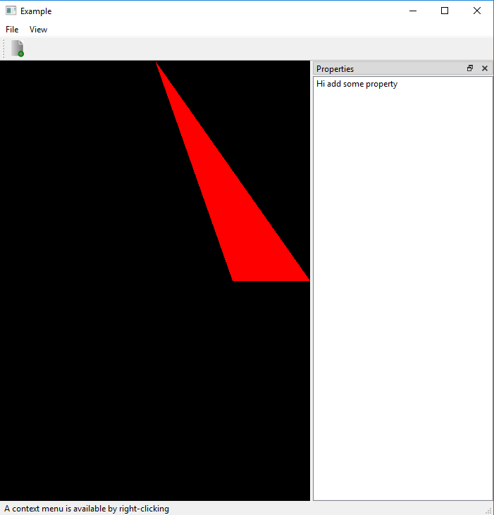

# OpenGl-Triangle-Shader

Draw a red triangle:
  1) draw a red triangle with shaders
  2) vertex shader is a pass through shader
  3) fragment shader is assigned with right color
  
Output Image:

References:
1) http://ogldev.atspace.co.uk/www/tutorial03/tutorial03.html
2) https://learnopengl.com/Getting-started/Hello-Triangle
3) http://www.opengl-tutorial.org/beginners-tutorials/tutorial-2-the-first-triangle/

